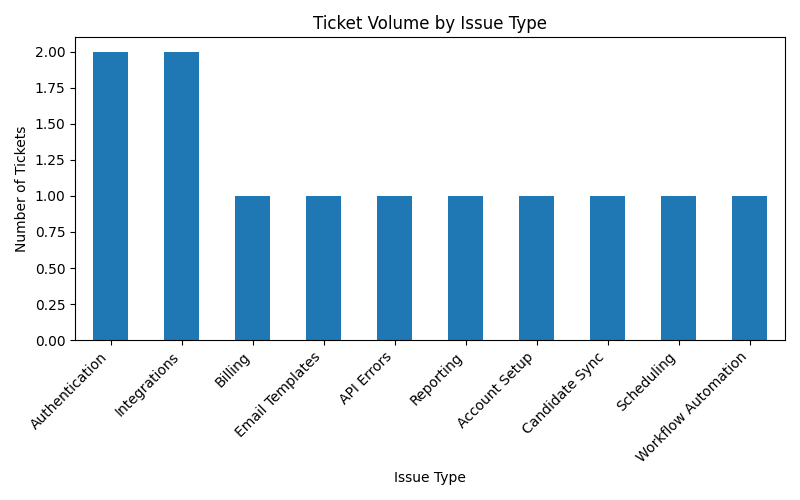
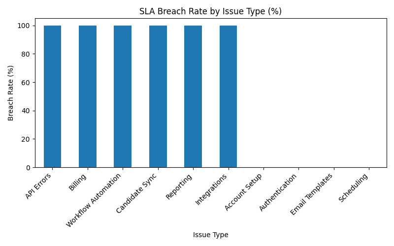

# SQL Analytics Case Studies

A portfolio of SQL projects focused on business analytics, operations insights, and workflow optimization.

## Projects

### Support Operations Analytics
SQL case study analyzing SaaS support ticket data to identify workload drivers, SLA risk, and process improvement opportunities.

## Visual Insights

### Ticket Volume by Issue Type

### SLA Breach Rate by Issue Type

